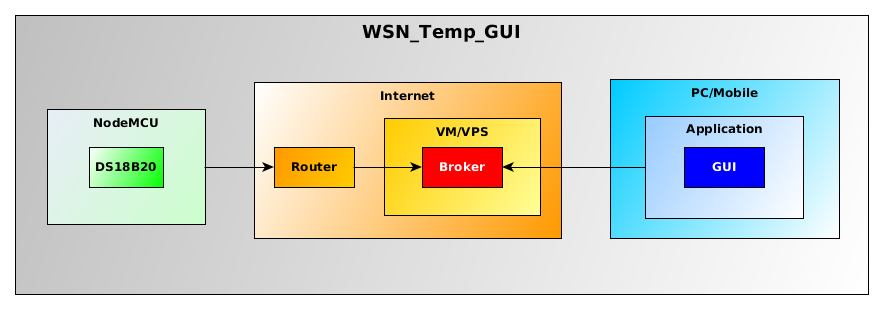
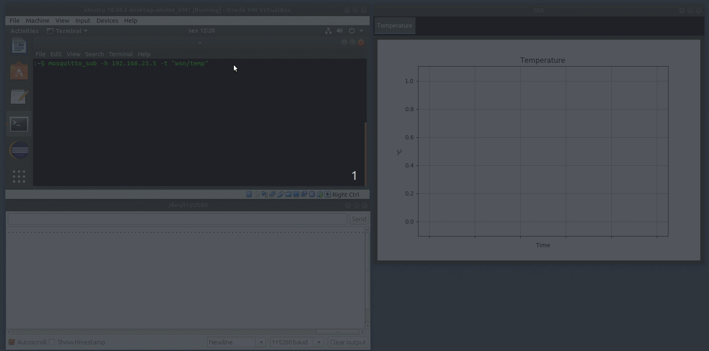

# WSN_Temp_GUI
ESP8266/ESP32 Temperature Measurement Wireless Sensor Node (+DS18B20) with Graphical User Interface program.

### 1 - Overview

This project comprises a minimal HW/SW design for the ESP8266 Node MCU board to send periodic measurements from the DS18B20 digital temperature sensor to a Python-based graphical user interface program through 'mosquitto' MQTT broker. A general block diagram of the included parts is depicted below.



### 2 - Contents

- '/wsn' -> hardware (Eagle schematic and board files) and software (Arduino files) related to the Node MCU board.

- '/client' -> all the software for the GUI program.

### 3 -  Components

NOTE: change the IP address, SSID and password in the 'wsn_v001_main.ino' (lines 49, 50 and 52) and 'gui_vars.py' (line 21) files to match your broker's IP and desired Wifi router credentials before running this project.

#### 3.1 - Broker

The MQTT message broker client called 'mosquito' (https://mosquitto.org/) was used in a virtual machine (VirtualBox) with Ubuntu 18.04 LTS in this project. To install required application and libraries:
```
$ sudo apt-add-repository ppa:mosquitto-dev/mosquitto-ppa
$ sudo apt-get update
$ sudo apt-get install mosquitto
$ sudo apt-get install mosquitto-clients
```

After installation, mosquitto is enabled as a service and its status can be checked with:
```
$ service mosquitto status
```

Incoming messages can be checked by subscribing to the desired channel, such as:
```
$ mosquitto_sub -h <BROKER_IP> -t <TOPIC>
```

#### 3.2 - Wireless Sensor Node (WSN)

The temperature measurement system is provided by a ESP8266 NodeMCU board and a DS18B20 digital IC thermometer. The software was developed using the Arduino 1.8.9 IDE and the following libraries are needed:

- ESP8266 Arduino Core (http://arduino.esp8266.com/Arduino/versions/2.0.0/doc/installing.html),

- WiFiManager (tzapu),

- PubSubClient (Nick O' Leary),

- OneWire (several authors) and

- DallasTemperature (Tim Burton, etc.).

If desired, a virtual WiFi hotpost can be created with 'create_ap' (https://github.com/oblique/create_ap) in Linux to hide the router's credentials while developing. To start the bridged WiFi interface for this project:
```
$ sudo create_ap <INTERFACE> <INTERFACE> <NEW_SSID> <NEW_PASSWORD>
```

#### 3.3 - Application with GUI

As the main user interface, a Python-based application (gui_main.py) was designed to receive temperature measurements and plot them in (almost) real time. The program also logs all data in a csv file. The main libraries for this project are:

 - Kivy (GUI framework) and
 
 - Matplotlib (chart plotting).
 
For better management of the development process (sandboxing of specific Python libraries), the GUI program was developed inside a virtual environment using the 'venv' package. All required libraries are depicted in the 'libs.txt' file. To create and initialize a new dev environment, create a separate folder and run the following commands:
```
$ python3 -m venv <DEV_PATH>      ## Create the environment
$ source <DEV_PATH>/bin/activate  ## Enable the environment
```
To install the libraries used in the GUI program, move the "libs.txt" file to the dev path and run:
```
$ pip install -r libs.txt
```

After that, don't forget to add all Python library paths to the .gitignore file. Finally, copy all the /src files to the dev path, run the 'gui_main.py' script and enjoy!

#### 3.4 - Example usage


